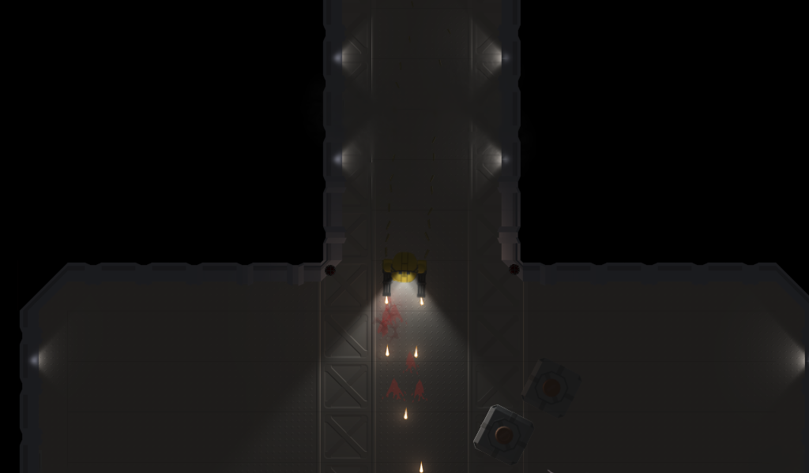

# robobill

A small 2d shaded graphics experiment, inspired by the Robokill browser game.

Features:
 - Pre-rendered, shaded, animated sprites
 - Animated, shaded 2d particles
 - Shaded smoke particles blur background elements
 - Non-uniform 2D lights (headlamps, warning lights, etc.)
